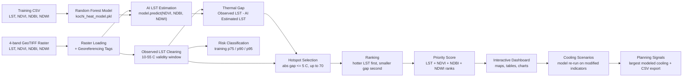

# HeatShield AI — Kochi Urban Heat Intelligence

**AI-Powered Urban Heat Intelligence & Cooling Optimization**

A Streamlit application that combines satellite-derived environmental indicators with a
trained Random Forest regression model to map urban heat in Kochi, Kerala, India, detect
thermal hotspots using a strict observation-model agreement rule, and compare hypothetical
cooling interventions.

---

## Overview

Urban areas often develop localized heat hotspots. Dense built-up surfaces, impervious
materials, sparse vegetation and limited water-related features can all contribute to
surface temperatures that are noticeably hotter than their surroundings. These patterns are
difficult to read from raw temperature numbers alone, and harder still to turn into concrete
mitigation decisions.

**HeatShield AI** addresses this by pairing two things:

1. **Observed satellite Land Surface Temperature (LST)** — the measured thermal signal over
   the study area.
2. **An AI estimate of LST** — a Random Forest regression model that reconstructs expected
   LST from three environmental indicators: **NDVI** (vegetation), **NDBI** (built-up
   surface) and **NDWI** (water-related signal).

The difference between the observation and the model estimate is the project's central
concept: the **Thermal Gap**. Instead of ranking hotspots purely by temperature, HeatShield
AI only promotes locations where the observed satellite temperature and the AI estimate are
relatively consistent (|Thermal Gap| ≤ 5°C). This prevents a handful of extreme
observation-model disagreements from dominating the planning list.

Kochi is the study area because the available raster, training dataset and trained model are
all built for the Kochi region.

The application is intended for planning support: it surfaces where heat concentrates, how
the surrounding environment looks at those points, how confident the observation/model
agreement is there, and what modeled temperature change environmental interventions might
produce. All outputs are presented as **model-based signals to be validated in the field**,
not as guaranteed outcomes.

---

## Key Features

- **Interactive multi-page dashboard** with six sections: Command Center, Heat Map, Hotspot
  Intelligence, Cooling Simulator, AI Planning, and Model & Data.
- **Satellite LST visualization** over geographic coordinates, with invalid data filtered out.
- **Multi-layer environmental mapping**: observed LST, NDVI, NDBI, NDWI, AI-estimated LST,
  and the Thermal Gap surface.
- **AI LST estimation** from NDVI/NDBI/NDWI using a pre-trained Random Forest model.
- **Percentile-based heat risk classification** (Low / Moderate / High / Extreme) derived from
  the training LST distribution.
- **Thermal-gap-filtered hotspot detection** with an explicit |Thermal Gap| ≤ 5°C selection
  rule and a defined fallback when too few pixels qualify.
- **Hotspot ranking and numbering** (up to 70 hotspots) with a composite Priority Score.
- **Per-hotspot intelligence view** showing observed LST, AI estimate, thermal gap, risk,
  coordinates and environmental profile, plus a gap-agreement status banner.
- **Descriptive AI interpretation** comparing a hotspot's indicators against training-data
  medians.
- **Cooling scenario simulator** that modifies NDVI/NDBI/NDWI inputs and re-runs the model to
  compare baseline, green infrastructure, cool roof / reflective surface, blue infrastructure
  and integrated cooling.
- **AI Planning page** that repeats the scenario comparison against training-distribution
  targets, reports the intervention with the largest modeled cooling, and emits heuristic
  planning signals.
- **CSV exports** for the selected hotspot dataset and the scenario comparison.
- **Model transparency**: R², RMSE, MAE, model hyperparameters, feature importance, dataset
  statistics, and an observed-vs-predicted scatter plot.

> Note: this is a scenario-comparison and mapping tool. It does not perform spatial
> optimization, cost optimization, or real-time monitoring. See
> [Limitations](#limitations).

---

## How It Works



At startup the application loads four files (training CSV, trained model, raster, metadata).
If any required file is missing or a raster shape is unexpected, startup is halted with an
error. All derived products — predictions, risk raster, hotspot table and metrics — are
computed once before the page is rendered, then reused across pages.

---

## Hotspot Detection

Hotspot extraction is implemented in `extract_hotspots()` in `app.py` and is the most
important logic in the project. It is deliberately **not** a simple "hottest pixels" filter.

### Constants

| Constant | Value | Meaning |
| -------- | ----- | ------- |
| `MAX_THERMAL_GAP` | `5.0` | Maximum allowed absolute thermal gap for hotspot selection |
| `MAX_HOTSPOTS` | `70` | Maximum number of hotspots retained |
| `MIN_VALID_LST` | `10.0` | Lower bound of the valid LST window (°C) |
| `MAX_VALID_LST` | `55.0` | Upper bound of the valid LST window (°C) |
| `FEATURES` | `["NDVI", "NDBI", "NDWI"]` | Model input features |

### Selection logic (as implemented)

A pixel is a hotspot candidate only if **all** of the following hold:

1. It has a valid observed LST (finite and inside the 10–55°C window after cleaning).
2. It has a valid AI prediction.
3. It has valid NDVI, NDBI and NDWI values.
4. `|Observed LST − AI Estimated LST| <= 5.0°C`.

The absolute thermal gap is computed as `abs(observed - predicted)` and the strict filter is:

```python
gap_mask = absolute_gaps <= max_thermal_gap
```

There is **no** "top N hottest" shortcut: qualifying pixels must pass the ≤ 5°C rule.

### Fallback rule

If fewer than 70 pixels satisfy the threshold, the code does **not** simply return fewer
hotspots. It instead fills the remaining positions by taking the pixels with the **smallest
absolute thermal gaps** (regardless of whether they pass the 5°C threshold), so the dashboard
still has candidates to display:

```python
if len(qualifying_indices) < number:
    smallest_gap_order = np.argsort(absolute_gaps)
    candidate_indices = flat_indices[smallest_gap_order]
else:
    candidate_indices = qualifying_indices
```

As a result, a hotspot shown in the dashboard can occasionally have an absolute gap slightly
above 5°C when the fallback path is used. The per-hotspot view flags this explicitly with a
warning banner.

### Ranking

Among the candidate pixels, ordering is by two keys using `np.lexsort`:

1. **Primary** — hotter observed LST first (descending).
2. **Secondary** — smaller absolute thermal gap first (ascending).

The final table is then re-sorted by `Observed LST` descending and `Absolute Thermal Gap`
ascending, and hotspot IDs are reassigned after sorting.

### Hotspot IDs

IDs are simple sequential labels generated from the sorted order:
`Hotspot #1`, `Hotspot #2`, … `Hotspot #N`. Because the table is re-sorted and re-numbered at
the end, `Hotspot #1` is the hottest of the selected set (ties broken by the smaller absolute
thermal gap).

### Priority Score

Every hotspot receives a composite Priority Score (0–100) built from percentile ranks within
the selected set:

| Component | Weight | Direction |
| --------- | ------ | --------- |
| Observed LST | 0.50 | higher is higher priority |
| NDVI | 0.15 | lower is higher priority |
| NDBI | 0.20 | higher is higher priority |
| NDWI | 0.15 | lower is higher priority |

```text
Priority Score = 100 × ( 0.50·rank(LST) + 0.15·rank(−NDVI) + 0.20·rank(NDBI) + 0.15·rank(−NDWI) )
```

### Risk classification

Risk labels are assigned per pixel (and per hotspot) from **training-dataset LST percentiles**:

| Label | Condition |
| ----- | --------- |
| Extreme | LST ≥ p95 |
| High | LST ≥ p90 |
| Moderate | LST ≥ p75 |
| Low | LST < p75 |
| Unknown | Non-finite LST |

These are distribution-relative categories, not universal health thresholds.

---

## Thermal Gap

**Thermal Gap = Observed LST − AI Estimated LST**

- **Observed LST** comes from band 1 of the GeoTIFF raster (satellite-derived land surface
  temperature), after cleaning.
- **AI Estimated LST** comes from the Random Forest model applied to the raster's NDVI, NDBI
  and NDWI bands.

Why it matters in this project:

- A **small** gap means the satellite observation and the feature-based model estimate agree,
  so the location is considered "usable" for planning and is what the hotspot filter prefers.
- A **large** gap (e.g. the +16°C / +17°C disagreements referenced in the code comments)
  signals a location where the observation differs strongly from what the environmental
  features would predict — such locations are excluded from the preferred hotspot set.
- The gap is a **dashboard quality/selection criterion**, not an independent validation of
  model accuracy.

The Project treats the gap at three display levels per hotspot:

| Absolute gap | Displayed status |
| ------------ | ---------------- |
| ≤ 2°C | ✅ Strong observation-model agreement |
| ≤ 5°C | ℹ️ Acceptable observation-model agreement (retained) |
| > 5°C | ⚠️ Large observation-model difference |

The selected raster is also available as a full `Thermal Gap` layer (Observed − AI Estimated)
in the Heat Map page, rendered on a diverging `RdBu_r` scale.

---

## Cooling Optimization

HeatShield AI does **not** run a mathematical optimization algorithm. It performs
**scenario-based comparison**: it overrides one or more environmental indicators at a chosen
hotspot, then re-runs the trained Random Forest to see how the estimate responds.

The scenario inputs are derived from the training-data distribution:

| Intervention | Data used | How it is evaluated | Output |
| ------------ | --------- | ------------------- | ------ |
| **Baseline** | Hotspot's own NDVI, NDBI, NDWI | One model prediction on the unmodified inputs | Baseline predicted LST |
| **🌳 Green Infrastructure** | NDVI set to `max(base NDVI, training NDVI p75)` | Model re-run with the raised vegetation signal | Predicted LST, change vs baseline, cooling magnitude |
| **🏠 Cool Roof / Reflective Surface** | NDBI set to `min(base NDBI, training NDBI p25)` | Model re-run with the reduced built-up signal | Predicted LST, change vs baseline, cooling magnitude |
| **💧 Blue Infrastructure** | NDWI set to `max(base NDWI, training NDWI p75)` | Model re-run with the raised water-related signal | Predicted LST, change vs baseline, cooling magnitude |
| **🌳💧 Integrated Cooling** | All three targets applied together | Model re-run with combined changes | Predicted LST, change vs baseline, cooling magnitude |

For each scenario the application reports:

- `Predicted LST` (°C)
- `Change vs Baseline` (°C) — `predicted − baseline`
- `Cooling Magnitude` (°C) — `baseline − predicted`

The **Cooling Simulator** page displays these in a table plus a bar chart with a dashed
baseline reference line. The **AI Planning** page applies the same target values and
additionally reports the intervention with the largest modeled cooling for the selected
hotspot.

The application explicitly states that these are **model-based scenario comparisons, not
guaranteed real-world cooling values**.

---

## AI / Machine Learning

The project uses one trained model, loaded from `kochi_heat_model.pkl` via `joblib`.

| Property | Value (from `model_metadata.json`) |
| -------- | ---------------------------------- |
| Model | Random Forest Regressor |
| Target | LST (land surface temperature) |
| Features | NDVI, NDBI, NDWI |
| `n_estimators` | 200 |
| `max_depth` | 15 |
| Training samples | 7997 |
| Test samples | 2000 |
| R² | 0.8156 |
| RMSE | 1.5715 |
| MAE | 1.1289 |

**Inference workflow**

- For the raster: every pixel with finite NDVI, NDBI and NDWI is stacked into a feature
  matrix and passed to `model.predict()` in one batch. Non-finite pixels are left as `NaN`.
- For a hotspot scenario: a single-row array `[[NDVI, NDBI, NDWI]]` is passed to the model.
- For validation: a reproducible sample of `min(2000, len(df))` rows is drawn with
  `random_state=42` and predicted for the observed-vs-predicted scatter plot.

**Feature importance** is read from `model.feature_importances_` when available and displayed
as a bar chart, with the caption that feature importance indicates predictive contribution,
not causality.

**Descriptive "AI interpretation"** on the Hotspot Intelligence page is rule-based text, not a
model output. It compares the hotspot's NDVI / NDBI / NDWI against the training-data medians
and reports whether each signal is above or below the median.

The model is **pre-trained and shipped with the repository**; the application never trains.
If there is no trained ML model available, the app cannot function normally — the AI estimate,
risk classification, hotspot selection and all cooling scenarios depend on it.

---

## Geospatial Processing

Raster and coordinate handling is implemented with **`tifffile`** and **NumPy**. The project
does not use Rasterio, GeoPandas, Shapely, GDAL or any CRS/EPSG metadata library.

- **Raster format**: a 4-band GeoTIFF (`Kochi_HeatShield_Raster.tif`), read with
  `tifffile.TiffFile(...).asarray()`.
- **Band order**: band 0 = LST, band 1 = NDVI, band 2 = NDBI, band 3 = NDWI. Both
  `(4, rows, cols)` and `(rows, cols, 4)` layouts are handled — the latter is transposed with
  `np.moveaxis`. Any other shape raises an error.
- **Georeferencing**: pixel-to-coordinate mapping uses the TIFF's `ModelPixelScaleTag` and
  `ModelTiepointTag` to produce longitude/latitude **pixel-center** coordinates (origin +
  `(index + 0.5) × pixel size`, with latitude decreasing down the rows).
- **Fallback (no georeferencing tags)**: longitudes `np.linspace(76.20, 76.40, cols)` and
  latitudes `np.linspace(10.10, 9.85, rows)`.
- **Spatial filtering** is pixel-based: an LST validity mask (`10 ≤ LST ≤ 55` and finite) plus
  the joint finite mask across LST, prediction, NDVI, NDBI and NDWI.
- **Coordinate system / projection**: no CRS or EPSG code is set or read by the application.
  This functionality is not explicitly documented in the current implementation.

Maps are rendered with Plotly `go.Heatmap` on longitude/latitude axes using
`Turbo`, `Greens`, `Oranges`, `Blues` and `RdBu_r` color scales.

---

## Data

| Dataset | Format | Purpose | Required |
| ------- | ------ | ------- | -------- |
| `kochi_heat_data.csv` | CSV (9,998 data rows) | Training/reference table with columns `LST`, `NDVI`, `NDBI`, `NDWI`, `Heat_Risk`. Used for risk percentiles, median baselines, scenario targets, dataset stats and the validation scatter plot. Also drives the training-data median comparisons in the interpretation/planning signals. | ✅ Yes |
| `kochi_heat_model.pkl` | Pickled scikit-learn model (~30 MB) | Pre-trained Random Forest Regressor used for AI LST estimation and all cooling scenarios. | ✅ Yes |
| `Kochi_HeatShield_Raster.tif` | 4-band GeoTIFF (~12.8 MB) | Spatial source of observed LST, NDVI, NDBI and NDWI for the maps and hotspot detection. | ✅ Yes |
| `model_metadata.json` | JSON | Model provenance and validation metrics (model name, target, features, hyperparameters, sample counts, R², RMSE, MAE). | Optional — the app falls back to defaults/`N/A` if missing, malformed or unreadable |

The application raises `FileNotFoundError` or `ValueError` for the CSV, model and raster if
they are missing or malformed; the metadata file is optional.

---

## Technology Stack

| Technology | Purpose |
| ---------- | ------- |
| Python | Application language |
| Streamlit | Web application framework and UI (sidebar navigation, metrics, tables, downloads) |
| NumPy | Raster array handling, masking, ranking (`np.lexsort`, `np.flatnonzero`, `np.unravel_index`) |
| Pandas | DataFrames for hotspots, scenarios, model info and dataset statistics; CSV export |
| tifffile | Reading the 4-band GeoTIFF raster and its georeferencing tags |
| joblib | Loading the pre-trained model (`kochi_heat_model.pkl`) |
| Plotly (`graph_objects`, `express`) | Heatmaps, bar charts, scatter plots |
| scikit-learn | Random Forest Regressor; required implicitly to deserialize the pickled model (not imported directly in `app.py`) |

Exact versions are pinned in `requirements.txt` (the seven direct dependencies above, with transitive dependencies such as SciPy and Matplotlib resolved by pip).

---

## Project Structure

```text
.
├── app.py                        # Main application — the Streamlit entry point
├── app_v1_backup.py              # Earlier iteration (backup)
├── app_v2_backup.py              # Earlier iteration (backup)
├── app_georef_backup.py          # Earlier iteration (backup)
├── app_before_qc_fix.py          # Earlier iteration (backup)
├── app_before_full_fix.py        # Earlier iteration (backup)
├── app_final_backup.py           # Earlier iteration (backup)
├── kochi_heat_data.csv           # Training dataset
├── kochi_heat_model.pkl          # Pre-trained Random Forest model
├── Kochi_HeatShield_Raster.tif   # 4-band GeoTIFF raster
├── model_metadata.json           # Model metrics and provenance
├── requirements.txt              # Pinned Python dependencies
├── test_streamlit.py             # Present but empty (0 bytes)
├── .gitignore                    # Excludes .venv, __pycache__ and large artifacts
└── README.md
```

The `app_*_backup.py` files are historical snapshots and are not used by the running
application. Only `app.py` is the entry point. `test_streamlit.py` exists but contains no
content, so there is currently no test suite.

> **Note on large artifacts.** `kochi_heat_model.pkl` and `Kochi_HeatShield_Raster.tif` are
> listed in `.gitignore` because of their size (~30 MB and ~12.8 MB). They are still
> **required at runtime** — if you clone this repository, obtain these files separately and
> place them next to `app.py`, or the app will stop at startup.

---

## Installation

Requires Python 3 and a working `pip`. From the project directory:

```bash
python -m venv venv
```

Activate the environment.

Windows (bash / Git Bash):

```bash
venv/Scripts/activate
```

Windows (CMD / PowerShell):

```bash
venv\Scripts\activate
```

macOS / Linux:

```bash
source venv/bin/activate
```

Install the pinned dependencies:

```bash
pip install -r requirements.txt
```

`requirements.txt` pins the seven direct dependencies: Streamlit, NumPy, Pandas, tifffile, joblib, Plotly and scikit-learn.

Then confirm that these files are present in the project directory (the app halts at startup
if any of the first three are missing):

- `kochi_heat_data.csv`
- `kochi_heat_model.pkl`
- `Kochi_HeatShield_Raster.tif`
- `model_metadata.json` (optional)

The model and raster files are excluded by `.gitignore` (see
[Project Structure](#project-structure)), so a fresh clone will not contain them — restore
or download them separately before launching.

---

## Running the Application

Launch the main application with Streamlit:

```bash
streamlit run app.py
```

Streamlit will print a local URL (by default `http://localhost:8501`). Open it in a browser.

> Do not run `app_v2_backup.py` or the other backup files — they are earlier iterations kept
> for reference, and the project's entry point is `app.py`.

---

## User Workflow

1. **Launch** HeatShield AI with `streamlit run app.py`.
2. **Scan the Command Center** for maximum/mean LST, the high/extreme area share and the
   number of usable hotspots, plus the Kochi Heat Action Signal.
3. **Inspect the heat map** to see where heat concentrates across the study area.
4. **Explore layers** on the Heat Map page (LST, NDVI, NDBI, NDWI, AI-estimated LST, Thermal
   Gap) using the layer selector.
5. **Review the selected hotspots table** and download the hotspot dataset if needed.
6. **Open Hotspot Intelligence** to examine one hotspot's observed LST, AI estimate, thermal
   gap, risk, agreement status, coordinates, environmental profile and priority score.
7. **Run cooling scenarios** in the Cooling Simulator to compare modeled LST under green,
   cool-roof, blue and integrated interventions.
8. **Use AI Planning** to see planning signals and the intervention with the largest modeled
   cooling, then export the scenario comparison.
9. **Check Model & Data** for validation metrics, feature importance and methodology notes.
10. **Take results into planning discussions**, validating with field measurements before
    implementation.

---

## Application Screens / UI

Navigation is a sidebar radio with six pages. The sidebar also shows a "Usable Hotspots"
metric and the active selection filter caption (`|Thermal Gap| ≤ 5.0°C`).

### 🏠 Command Center

- Four headline metrics: **Maximum valid LST**, **Mean valid LST**, **High / Extreme area**
  (share of valid pixels ≥ p90) and **Usable hotspots**.
- A **Kochi Heat Action Signal** info panel describing the prioritization logic and the
  small-thermal-gap filter.
- A **Kochi Heat Risk Overview** heatmap of valid LST (downsampled for rendering) with
  longitude, latitude and LST in the hover template.
- A **Selected Hotspots** table (top 70 or fewer) with hotspot ID, coordinates, observed LST,
  AI-estimated LST, thermal gap, risk and priority score.
- A **Download hotspot dataset** button exporting `kochi_heatshield_hotspots.csv`.
- A **How HeatShield AI Works** row summarizing Detect → Explain → Plan.

### 🌡️ Heat Map

- Layer selector with six options: **Land Surface Temperature**, **NDVI — Vegetation**,
  **NDBI — Built-up Signal**, **NDWI — Water Signal**, **AI Estimated LST**, **Thermal Gap**.
- A Plotly heatmap with an appropriate color scale for the chosen layer.
- A **Layer Interpretation** section explaining how to read the selected layer.

### 🔥 Hotspot Intelligence

- Hotspot selector (all detected hotspots).
- Metrics: **Observed LST**, **AI Estimated LST**, **Risk** (training-data percentile) and
  **Thermal Gap**.
- A gap-status banner: strong agreement (≤ 2°C), acceptable (≤ 5°C) or large difference
  (> 5°C).
- A **Hotspot Location** table with latitude, longitude, priority score and absolute thermal
  gap.
- An **Environmental Profile** with NDVI/NDBI/NDWI metrics and a bar chart.
- An **AI Interpretation** list comparing each indicator to the training-data median, with a
  caption clarifying these are descriptive inputs, not causal proof.

### 🧊 Cooling Simulator

- Hotspot selector.
- **Current Environmental State** metrics: observed LST, AI baseline, thermal gap, risk.
- A **Scenario Comparison** table for Baseline, Green Infrastructure, Cool Roof / Reflective
  Surface, Blue Infrastructure and Integrated Cooling, including predicted LST, change vs
  baseline and cooling magnitude.
- A bar chart of modeled LST per scenario with a dashed baseline line.
- An important modeling note that these are model-based comparisons, not real-world cooling
  guarantees.

### 🤖 AI Planning

- Hotspot selector.
- An **AI Planning Signal** success panel naming the intervention with the largest modeled
  reduction for that hotspot and its modeled temperature change.
- A **Hotspot Planning Profile** with observed LST, AI baseline, thermal gap and priority
  score.
- **Planning Signals** — warnings/info for low vegetation, high built-up signal and low
  water-related signal relative to training-data medians.
- A **Scenario Planning Matrix** table with predicted LST, change vs baseline and modeled
  cooling.
- A **Download scenario comparison** button exporting `kochi_heatshield_scenarios.csv`.
- A caption noting the signals are heuristic/model-based and should be combined with field
  validation, engineering feasibility, cost, land availability and community considerations.

### 📊 Model & Data

- **Machine Learning Model** metrics: R², RMSE, MAE, plus a model info table (model, target,
  features, training samples, estimators, maximum depth).
- **Feature Importance** bar chart (when the loaded model exposes `feature_importances_`).
- **Training Dataset** metrics (rows, mean LST, P90, P95) and `df.describe()` statistics.
- **Observed vs AI Prediction** scatter plot with a dashed 1:1 reference line, drawn from a
  reproducible 2,000-row sample (or the full dataset if smaller).
- **Data & Methodology** notes covering satellite variables, ML, risk classification, hotspot
  selection and scenario planning.
- A **Model limitation** warning restating that feature importance is not causal evidence,
  the thermal-gap filter is not a validation of accuracy, and field validation plus
  feasibility considerations are required.

A global footer repeats the project name and credits satellite + machine learning + scenario
planning.

---

## Outputs

The application produces, in-memory and on screen:

- **Maps** — observed LST, NDVI, NDBI, NDWI, AI-estimated LST and Thermal Gap heatmaps.
- **Hotspot list** — up to 70 entries with ID, latitude, longitude, observed LST, AI-estimated
  LST, Thermal Gap, Absolute Thermal Gap, NDVI, NDBI, NDWI, Risk and Priority Score.
- **Risk labels** — Low / Moderate / High / Extreme per pixel and per hotspot.
- **Per-hotspot assessment** — gap-agreement status and descriptive environmental
  interpretation.
- **Scenario comparison tables and charts** — predicted LST, change vs baseline and cooling
  magnitude per intervention.
- **Planning signal** identifying the intervention with the largest modeled cooling for the
  selected hotspot.
- **CSV downloads**:
  - `kochi_heatshield_hotspots.csv` — the full hotspot dataset.
  - `kochi_heatshield_scenarios.csv` — the scenario planning matrix for the selected hotspot.

No PDF or automated report generation is implemented.

---

## Configuration

There is **no** configuration file, `.env` file, environment variable, API key or external
service used by the application. All paths are resolved relative to the location of `app.py`:

| Constant | Path |
| -------- | ---- |
| `BASE_DIR` | `Path(__file__).resolve().parent` |
| `DATA_FILE` | `kochi_heat_data.csv` |
| `MODEL_FILE` | `kochi_heat_model.pkl` |
| `RASTER_FILE` | `Kochi_HeatShield_Raster.tif` |
| `METADATA_FILE` | `model_metadata.json` |

Tunable values live as constants in `app.py` (`MIN_VALID_LST`, `MAX_VALID_LST`,
`MAX_THERMAL_GAP`, `MAX_HOTSPOTS`, `FEATURES`, `RISK_LABELS`). Changing them requires editing
the source; no runtime controls are exposed for them.

---

## Troubleshooting

**`FileNotFoundError: Missing file: kochi_heat_data.csv` / `kochi_heat_model.pkl` /
`Kochi_HeatShield_Raster.tif`**
The app expects these files next to `app.py`. Keep them in the project directory, or restore
them if they were moved or renamed. Note that the model and raster are intentionally excluded
by `.gitignore`, so they will be absent from a fresh clone until restored.

**`ValueError: Unexpected raster shape: ... Expected four bands.`**
The GeoTIFF must have exactly four bands (LST, NDVI, NDBI, NDWI). A raster with a different
band count or dimensionality will not load.

**`ValueError: Training data is missing columns: ...`**
`kochi_heat_data.csv` must contain at least `LST`, `NDVI`, `NDBI` and `NDWI`.

**Map appears geographically shifted**
When the GeoTIFF lacks `ModelPixelScaleTag` / `ModelTiepointTag`, the app falls back to a
fixed Kochi bounding-box approximation rather than true georeferencing, so positions are
approximate.

**`ModuleNotFoundError: No module named 'streamlit'` (or `tifffile`, `joblib`, `plotly`, etc.)**
The virtual environment is not active or dependencies were not installed. Activate the
environment and run `pip install -r requirements.txt` as shown in
[Installation](#installation).

**Model fails to load / scikit-learn errors while unpickling**
The pickle was produced with a compatible scikit-learn version; a mismatched major version can
break unpickling. Install a scikit-learn version compatible with the environment that trained
the model.

**"No hotspots were detected using the current 5.0°C thermal-gap threshold."**
This appears when the hotspot table is empty for the current raster (for example, if no pixel
has both a valid observation and a valid prediction). Check that the raster bands contain
finite values.

**Slow first load or high memory use**
The model file is ~30 MB and the raster is ~12.8 MB; loading and batch prediction occur once at
startup and are cached. Lower-memory machines may see a delayed first render. See
[Performance Considerations](#performance-considerations).

**`streamlit` opens but the page is blank or an exception is shown**
Startup errors are surfaced with `st.error` and `st.exception` and then execution stops. Read
the traceback shown in the browser or the terminal to identify the missing or malformed file.

---

## Performance Considerations

- **Startup work is front-loaded.** The training CSV, model, metadata and raster are all loaded
  before any page renders; predictions for the entire raster, the risk raster and the hotspot
  table are also computed at import time. First render therefore depends on available CPU and
  memory.
- **Streamlit caching is used.** `load_training_data`, `load_metadata`, `load_raster`,
  `calculate_predictions` and `extract_hotspots` are wrapped with `@st.cache_data`, and
  `load_model` with `@st.cache_resource`, so repeated page switches reuse results within a
  session instead of recomputing.
- **Batch raster prediction.** Predictions are vectorized: only finite pixels are gathered and
  passed to `model.predict()` in a single call, which is far cheaper than per-pixel inference.
- **Map downsampling.** Maps subsample the raster with a step of `max(rows, cols) / 200` (Heat
  Map) and `max(rows, cols) / 180` (Command Center), so the rendered grids stay bounded while
  hotspot analysis still runs on the full-resolution arrays.
- **Risk classification cost.** The risk raster uses `np.vectorize(classify_risk)` over finite
  pixels; on very large rasters this is the least vectorized step in the pipeline.
- **Validation sampling.** The observed-vs-predicted scatter uses at most 2,000 rows, keeping
  the Model & Data page responsive.

---

## Limitations

- **Geographic scope.** The model, raster and dataset are all specific to the Kochi study
  area. There is no multi-city support.
- **Static data.** The application reads fixed local files. There is no live satellite feed,
  no real-time environmental data and no temporal dimension beyond the single built-in dataset.
- **Fixed spatial resolution.** Analysis quality is bounded by the resolution of
  `Kochi_HeatShield_Raster.tif`. The exact ground resolution and image dimensions are read at
  runtime and are not documented in the repository.
- **No CRS metadata.** Coordinates are reconstructed from TIFF tags only; no projection or
  EPSG code is stored or validated, and a fallback bounding box is used when tags are absent.
- **Small-thermal-gap assumption.** Hotspot selection assumes the most useful planning
  locations are those where the observation and model agree within 5°C. This is a dashboard
  selection heuristic, not a validated quality guarantee, and the fallback path can include
  pixels that exceed the threshold.
- **Model is a statistical fit, not physics.** The Random Forest learns relationships between
  NDVI/NDBI/NDWI and LST in the provided dataset. Feature importance is not causal evidence,
  and the model does not simulate atmospheric or thermodynamic processes.
- **Scenario outputs are not guarantees.** Cooling values are predictions produced by feeding
  modified indicators back into the model. They are not measured or physically simulated
  cooling effects.
- **No optimization or costing.** Interventions are compared as fixed percentile-target
  scenarios; there is no cost, feasibility, land-availability or spatial optimization.
- **No independent model validation pipeline.** Reported R²/RMSE/MAE come from the stored
  metadata; the app reproduces a validation scatter plot but does not re-run a train/test
  split.
- **Risk labels are relative.** Low/Moderate/High/Extreme are percentiles of the training LST
  distribution, not public-health thresholds.
- **No tests.** `test_streamlit.py` is an empty file, so there is no automated test coverage.
- **Boundary conditions.** Because hotspot numbering is reassigned after sorting, IDs are
  positional and will change if the underlying data or thresholds change.

---

## Future Improvements

The following are **not implemented** and are listed only as potential future work:

- Real-time or near-real-time satellite/environmental data ingestion.
- Additional satellite sources and higher-resolution imagery.
- Extension to other cities and regions.
- Historical trend and time-series analysis.
- More advanced ML models, uncertainty quantification and cross-validation reporting.
- A user-tunable thermal-gap threshold and hotspot count in the UI.
- Spatial and cost optimization for intervention placement.
- Automated report (PDF) generation and richer export formats.
- Mobile-friendly layouts and deployment/hosting configuration.

---

## Hackathon Context

**Problem.** Urban heat concentrates unevenly. In a coastal, densely built city like Kochi,
impervious surfaces and limited vegetation can create localized hotspots that are easy to miss
when only city-wide averages are considered — and hard to act on without knowing where and why
heat builds up.

**Solution.** HeatShield AI turns satellite-derived land surface temperature and three
environmental indicators into an interactive heat-intelligence dashboard: it maps heat,
detects hotspots using a defensible observation-model agreement rule, explains the
environmental profile at each hotspot, and compares modeled cooling responses for green,
cool-roof, blue and integrated interventions.

**Technology.** Python, Streamlit, NumPy, Pandas, tifffile, joblib and Plotly, backed by a
scikit-learn Random Forest Regressor and a 4-band GeoTIFF raster.

**Data.** A 9,998-row satellite-derived training table (`LST`, `NDVI`, `NDBI`, `NDWI`,
`Heat_Risk`), a 4-band GeoTIFF for Kochi, and model metadata (R² ≈ 0.816, RMSE ≈ 1.57°C,
MAE ≈ 1.13°C).

**Innovation.** Rather than ranking the hottest pixels, the project uses the **Thermal Gap**
between observed and AI-estimated LST to keep only locations where the observation and the
environmental model agree within **5°C** (with a documented fallback), reducing the influence
of extreme outliers. It also exposes model behavior directly — predictions, feature
importance, validation scatter and explicit scenario caveats — instead of presenting
temperatures as unexplained outputs.

**Practical impact.** Planners, researchers and civic teams can quickly identify candidate
heat locations, understand their environmental context, and compare intervention scenarios
before committing resources.

**Scalability.** The pipeline is data-driven: given a raster and a corresponding trained model,
the same mapping, hotspot and scenario workflow can be applied to another city or dataset.
Scaling to new regions is presented as future work — the current implementation is bound to
the Kochi files.

All outputs are decision-support signals. They should be validated through field measurements
and combined with engineering feasibility, cost, land availability and community
considerations. The project does not claim guaranteed cooling or future temperature
prediction.

---

## Team

```text
HeatShield AI — Hackathon Project
```

No team member names, affiliations or contact details are present in the repository.

---

## License

No license file or license statement is present in this repository. No license is specified.

---

**Built with:** Satellite-derived environmental indicators · Random Forest heat estimation ·
Scenario-based cooling planning
